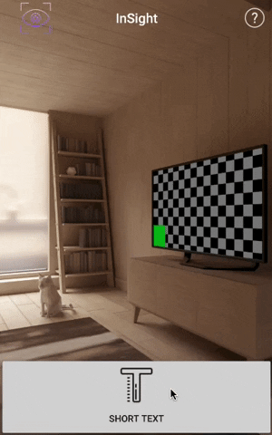
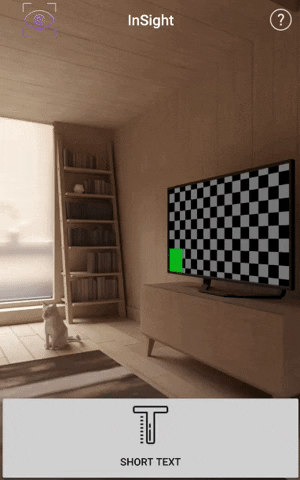
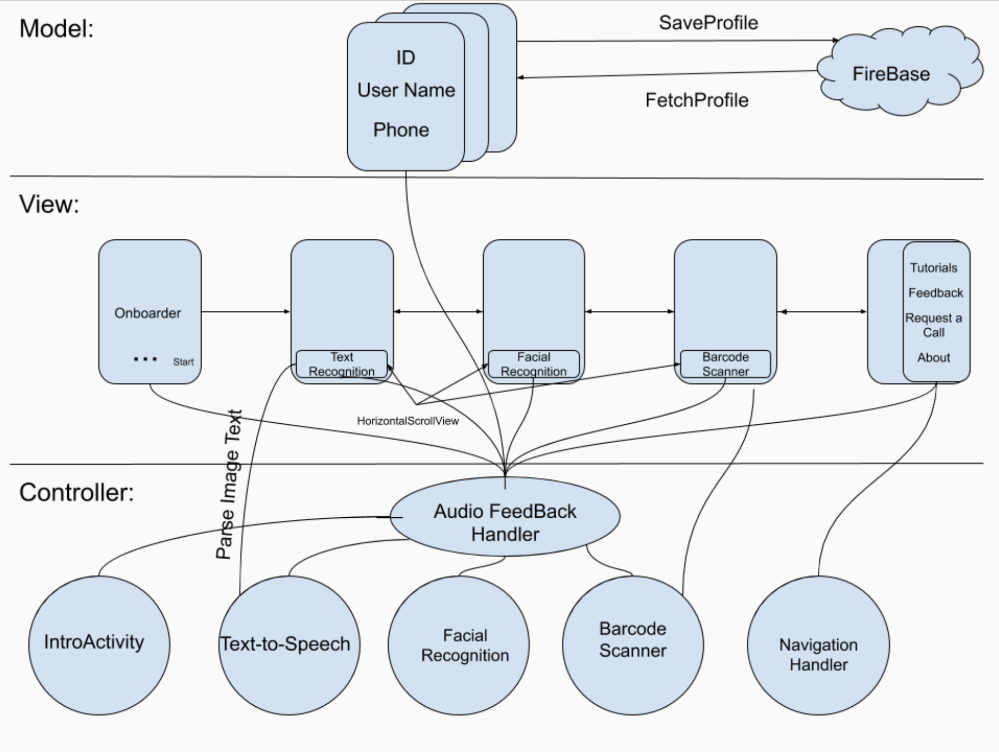
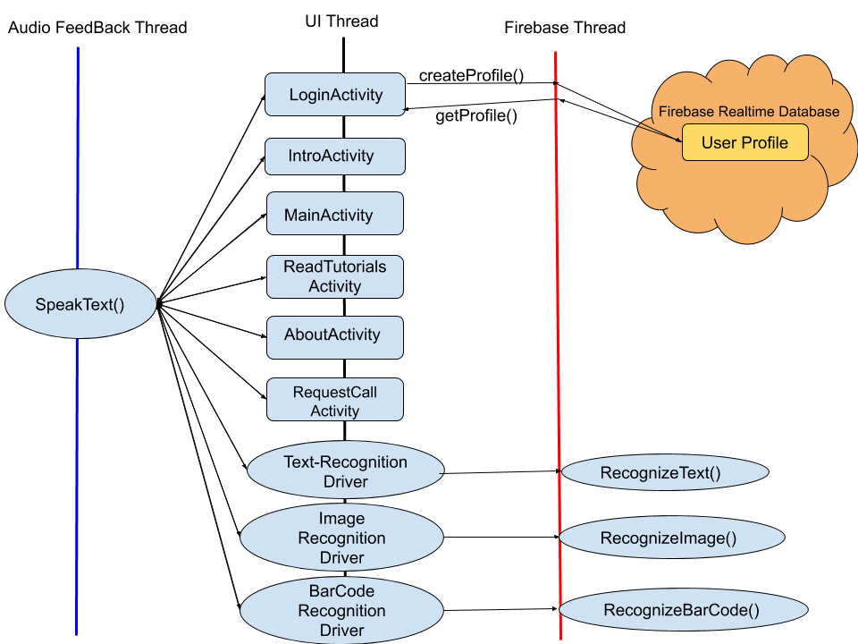

# InSight

## Dartmouth CS65 Final Project

### Download APK
[Click Here](https://drive.google.com/file/d/1RN2Lr7Om_vkkmr-kyk1o7294IshxdDjc/view?usp=sharing)

### Project Description:
InSight is an Android application aimed at improving the quality of life of the visually imapaired.
Using CameraX and Google Firebase, this app helps the visually impaired by providing features like:
- Using Firebase authentication to log users in via speech
- Providing audio feedback on button presses using Google's text to speech engine
- Using Firebase ML Kit's text recogintion API to recognize text and provide audio feedback
- Using Firebase ML Kit's image recognition API to recognize objects in the users surrounding, and provide audio feedback
- Add-on features like 'Read Tutorials', and 'Provide Feedback' that improve the users experience

### How to Use InSight
1. Open the app, and spell out your name when prompted to.  

2. Once logged in, swipe the bottom of the screen and press down to determine which feature you are on.
 

3. Once you have selected the desired feature, position the camera appropriately and tap the screen
to begin. Hold the phone steady while the camera takes in the image to be processed.

4. To log out, call for support, listen to the tutorial, provide feedback, learn more about InSight, or share
this app with a friend, swipe inward from the right edge of the screen, or press the help button in
the top right corner of screen to access the navigation view.  

### Original Pitch
[See the original project pitch](https://docs.google.com/presentation/d/1PjDBnxKh9KSKOLvDSTeLFw40MYGL8JayIdCbSn8xo9Q/edit?usp=sharing)

### Show and Tell 1:
#### MVC Diagram:

#### Who Is Doing What:
So far:
- Sylvester:UI, Native Android audio feedback and perception
- Sebastian: Firebase ML kit(Barcode scanner, text recognition, object recognition)
- Chris: UI, CameraX research

From here on out:
- Working together through specific feature tasks

#### Goals for Show and Tell 2:
- Have a custom Firebase authenticaton that allows users to log in using their voice
- Have text recognition working
- Completed UI

### Show and Tell 2:

#### Thread Design Diagram:

#### Update
- Finished 95% of the UI
- Finished implementing the text-recogniton feature
- Finished 75% of the audio feedback
- Finished Navigation Drawer Add-ons

#### What's Next?
- Finish the app!
- Clean up UI
- Finish implementing the Firebase realtime database
- Finish all audio feedback
- Add image recognition funcitonality
- If there's time, add barcode, color, or currency recogniton

#### Credits
Icon made by Icongeek26 from www.flaticon.com.

